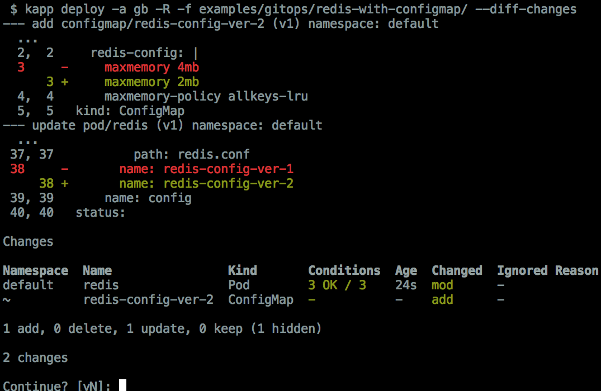

# kapp

- Website: https://carvel.dev/kapp
- Slack: [#carvel in Kubernetes slack](https://slack.kubernetes.io)
- [Docs](docs/README.md) with topics about diff, apply, gitops, config, _blog posts and talks_ etc.
- Install: grab prebuilt binaries from the [Releases page](https://github.com/vmware-tanzu/carvel-kapp/releases) or [Homebrew Carvel tap](https://github.com/vmware-tanzu/homebrew-carvel).
- Backlog: [See what we're up to](https://app.zenhub.com/workspaces/carvel-backlog-6013063a24147d0011410709/board?repos=175895515). (Note: we use ZenHub which requires GitHub authorization).

`kapp` (pronounced: `kap`) CLI encourages Kubernetes users to manage resources in bulk by working with "Kubernetes applications" (sets of resources with the same label). It focuses on resource diffing, labeling, deployment and deletion. Unlike tools like Helm, `kapp` considers YAML templating and management of packages outside of its scope, though it works great with tools that generate Kubernetes configuration.

See [https://carvel.dev/kapp](https://carvel.dev/kapp) for detailed example workflow.

Features:

- Works with standard Kubernetes YAMLs
- Focuses exclusively on deployment workflow, not packaging or templating
  - but plays well with tools (such as [ytt](https://get-ytt.io)) that produce Kubernetes configuration
- Converges application resources (creates, updates and/or deletes resources) in each deploy
  - based on comparison between provided files and live objects in the cluster
- Separates calculation of changes ([diff stage](docs/diff.md)) from application of changes ([apply stage](docs/apply.md))
- [Waits for resources](docs/apply-waiting.md) to be "ready"
- Creates CRDs and Namespaces first and supports [custom change ordering](docs/apply-ordering.md)
- Works [without admin privileges](docs/rbac.md) and does not use custom CRDs
  - making it possible to use kapp as a regular user in a single namespace
- Records application deployment history
- Opt-in resource version management
  - for example, to trigger Deployment rollout when ConfigMap changes
- Optionally streams Pod logs during deploy
- Works with any group of labeled resources (`kapp -a label:tier=web inspect -t`)
- Works without server side components
- GitOps friendly (`kapp app-group deploy -g all-apps --directory .`)

### Join the Community and Make Carvel Better
Carvel is better because of our contributors and maintainers. It is because of you that we can bring great software to the community. 
Please join us during our online community meetings. Details can be found on our [Carvel website](https://carvel.dev/community/).

You can chat with us on Kubernetes Slack in the #carvel channel and follow us on Twitter at @carvel_dev.

Check out which organizations are using and contributing to Carvel: [Adopter's list](https://github.com/vmware-tanzu/carvel/blob/master/ADOPTERS.md)

## Development

Consult [docs/dev.md](docs/dev.md) for build instructions, code structure details.
